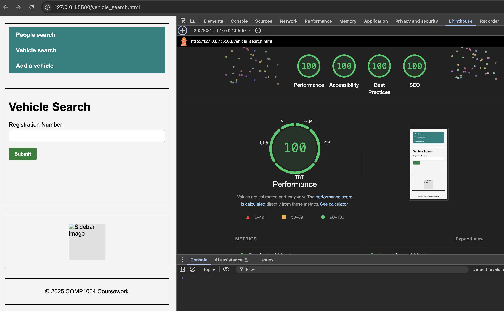
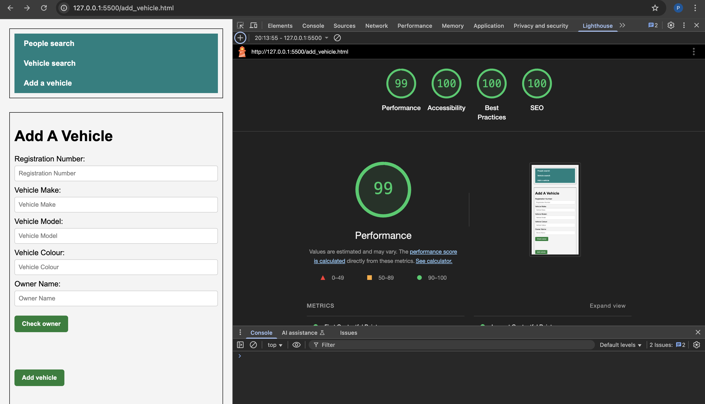
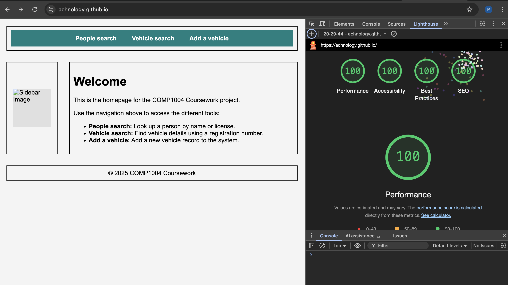

### COMP1004 Coursework Website – Pablo Gallegos Vargas
---
### Live Link
https://achnology.github.io
---
### Summary
This coursework consists of a responsive web application with three main functional HTML pages using Supabase as the backend. The project allows for:

Searching people by name or license number

Searching vehicles by registration number

Adding vehicles to the database with either existing or new owners

Accessibility, performance, and layout stability were addressed based on Lighthouse audits and Supabase testing.
---
### Completed Features (Sequentially) ✅ 
Set up Supabase project with people and vehicles tables.

Configured foreign key relationship between vehicles and owners.

Created and styled:

people_search.html

vehicle_search.html

add_vehicle.html

Wrote full Supabase JavaScript logic in scripts.js:

Query people by name or license

Query vehicles and join owners

Add new vehicles and prevent duplicates

Select or create a new owner

Implemented error messages and success feedback with accessibility in mind.

Polished all forms with labels, aria attributes, and client-side validation.

Resolved persistent CLS issues using CSS techniques (aspect-ratio, min-height, image placeholders).

Achieved 100% Lighthouse scores for Accessibility, SEO, and Best Practices; 99–100% Performance.

Added a custom index.html landing page with links to all tools.

Created a shared styles.css using Grid and Flexbox layout.

Performed multiple rounds of Lighthouse testing on all 3 HTML pages.

Set up a cron job to prevent Supabase from sleeping.

Used GitHub Pages to host the entire website.

Prepared all submission screenshots and testing summaries.
---
### HTML & CSS 💻

Page	Key Features
index.html	Navigation homepage with links to all tools
people_search.html	Form to search by name/license; handles no-match cases
vehicle_search.html	Vehicle lookup with owner details
add_vehicle.html	Add new vehicle and optionally new owner

## CSS Features:
---
Shared styling across all pages (styles.css)

Flexbox navigation

Grid layout via #container

Responsive stacking under 500px

Fully accessible buttons, labels, and input fields

Sidebar image using transparent pixel and aspect-ratio for layout stability

Accessibility Score: ~ 100/100
Responsive Design: Yes – tested under 500px screen width
File: styles.css (Lines ~1–250)

### JavaScript & Database 💻

All JavaScript lives in scripts.js

People and vehicle searches use .ilike() for case-insensitive partial matching

Vehicle and person details fetched and displayed dynamically

Duplicate owner check using full field match

Dynamic feedback shown using ARIA-friendly roles

Edge case handling for:

Empty search fields

Duplicate records

Missing selection

### Key DOM IDs (used in Playwright):

Page	Element ID
All pages	message, results
Add vehicle	owner, rego, make, model, colour, new-owner-form, add-owner, check-owner, add-vehicle
People search	name, license

### Lighthouse Results 

✅ Accessibility: 100

✅ Best Practices: 100

✅ SEO: 100

✅ Performance: 99–100 on all pages

### Included Screenshots:
---

